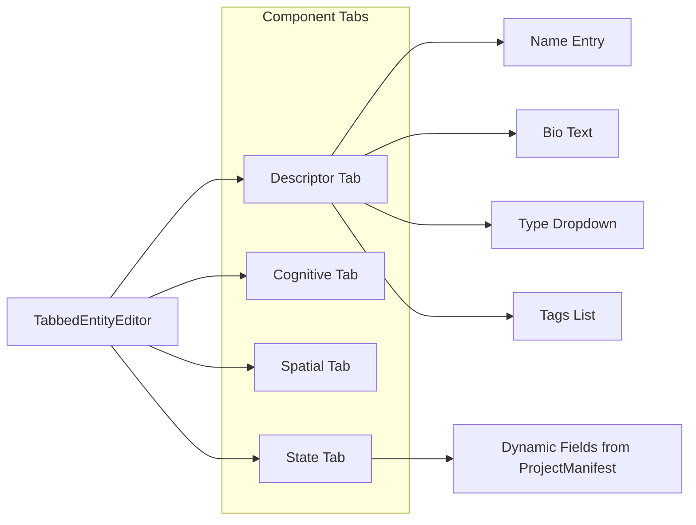

## Implementation

### 1. Multi-Format Input Support

Create a new converter module at `pyscrai_forge/harvester/converters/`:| File | Purpose ||------|---------|| `__init__.py` | Exports `FormatRegistry` || `registry.py` | Auto-detects file type, routes to appropriate converter || `pdf_converter.py` | Uses `pypdf` (already in requirements) to extract text || `html_converter.py` | Uses `beautifulsoup4` (already in requirements) to strip HTML || `docx_converter.py` | Uses `python-docx` (add to requirements) for Word docs || `ocr_converter.py` | Uses `pytesseract` (add to requirements) for images |Key interface:

```python
class FormatRegistry:
    def convert(self, file_path: Path) -> ConversionResult:
        """Returns extracted text + metadata."""
    
    def get_supported_formats(self) -> list[str]:
        """Returns list of supported extensions."""
```

Add an import dialog to the reviewer that:

- Shows file picker filtered to supported formats
- Displays extracted text preview before processing
- Provides progress feedback during conversion

### 2. Tabbed Entity Component Editor

Replace the generic `EditDialog` with `TabbedEntityEditor`:



Each tab provides form-based editing:| Component | Fields | Widget Type ||-----------|--------|-------------|| Descriptor | name, bio, entity_type, tags | Entry, Text, Combobox, Listbox || Cognitive | model_id, temperature, system_prompt, context_policy | Entry, Scale, Text, Combobox || Spatial | x, y, region_id, layer, capacity | Spinbox, Combobox, Entry || State | resources (dynamic from schema) | Generated from `ProjectManifest.entity_schemas` |The State tab is schema-aware:

- Loads field definitions from `ProjectManifest.entity_schemas[entity_type]`
- Generates appropriate widgets based on field types (`int` -> Spinbox, `float` -> Entry with validation, `str` -> Entry)
- Shows validation warnings for unknown fields

### 3. Relationship Editor

Create `RelationshipEditor` dialog with form layout:| Field | Widget ||-------|--------|| Source Entity | Searchable Combobox (populated from loaded entities) || Target Entity | Searchable Combobox || Relationship Type | Combobox with all `RelationshipType` enum values || Visibility | Combobox with `RelationshipVisibility` values || Strength | Scale widget (-1.0 to +1.0) || Description | Text widget || Metadata | Key-value editor (add/remove rows) |---

## File Changes Summary

### New Files

```javascript
pyscrai_forge/harvester/converters/
    __init__.py
    registry.py
    pdf_converter.py
    html_converter.py
    docx_converter.py
    ocr_converter.py

pyscrai_forge/harvester/ui/
    __init__.py
    entity_editor.py      # TabbedEntityEditor
    relationship_editor.py # RelationshipEditor  
    import_dialog.py      # File import with preview
    schema_widgets.py     # Dynamic widget generation from schema
```


### Modified Files

- [pyscrai_forge/harvester/reviewer.py](pyscrai_forge/harvester/reviewer.py): Replace `EditDialog` calls with new editors, add import menu option
- [requirements.txt](requirements.txt): Add `python-docx>=0.8.11`, `pytesseract>=0.3.10`

---

## Dependencies

Add to `requirements.txt`:

```javascript
python-docx>=0.8.11      # DOCX parsing
pytesseract>=0.3.10      # OCR for images (requires Tesseract binary)
```

Note: `pypdf` and `beautifulsoup4` are already included.

---

## Bug Fixes & Troubleshooting (January 2, 2026)

### Critical Issues Resolved

Before implementing Phase 1 enhancements, several critical bugs in the existing reviewer GUI were identified and fixed. These bugs prevented proper entity/relationship editing, display, and persistence.

#### Issue A: Project Manifest (`project.json`)

**Question**: Does `project.json` refer to a project config file or simply `entity_components.json`?

**Answer**: [project.json](data/projects/russia_ukraine_conflict/project.json) is the **ProjectManifest** configuration file (defined in [pyscrai_core/project.py](pyscrai_core/project.py)) that contains:
- Project metadata (name, version, author)
- **entity_schemas**: Custom resource field definitions per entity type
- LLM configuration, memory settings, simulation parameters

This is distinct from [entity_components.json](data/projects/russia_ukraine_conflict/entity_components.json) which contains harvested entities. Project manifest creation is deferred to Phase 2.

---

### Bug 1: Entity Edit Dialog Not Populating Fields ✓ FIXED

**Root Cause**: Data structure mismatch between Pydantic models and UI editor.

When [reviewer.py](pyscrai_forge/harvester/reviewer.py) loaded entity data using `json.loads(ent.model_dump_json())`, it created a dict with **lowercase keys** (`descriptor`, `cognitive`, `spatial`, `state`). However, [entity_editor.py](pyscrai_forge/harvester/ui/entity_editor.py) expected **capitalized keys** (`DescriptorComponent`, `CognitiveComponent`, etc.).

**Fix Applied**:
- Changed all component keys in [entity_editor.py](pyscrai_forge/harvester/ui/entity_editor.py#L20-L22) to lowercase
- Updated all component accessors throughout the file (lines 59, 99, 130, 146)

---

### Bug 2: StateComponent Resources Not Saving ✓ FIXED

**Root Cause**: Type confusion - `resources_json` is a **string field**, not a dict.

According to [pyscrai_core/models.py](pyscrai_core/models.py#L150), `StateComponent.resources_json` is defined as:
```python
resources_json: str = Field(default="{}", description="JSON string for dynamic stats")
```

The UI code treated it as a dict directly, causing save failures.

**Fix Applied**:
- [entity_editor.py](pyscrai_forge/harvester/ui/entity_editor.py#L148-L153): Parse JSON string to dict on load
- [entity_editor.py](pyscrai_forge/harvester/ui/entity_editor.py#L189-L191): Keep as string when saving from text editor
- [entity_editor.py](pyscrai_forge/harvester/ui/entity_editor.py#L219-L225): Stringify dict back to JSON when saving from schema widgets

---

### Bug 3: Relationship Treeview Showing IDs Instead of Names ✓ FIXED

**Root Cause**: Treeview displayed raw entity IDs instead of resolving them to entity names.

**Fix Applied**:
- [reviewer.py](pyscrai_forge/harvester/reviewer.py#L323-L327): Build entity ID-to-name lookup dict
- [reviewer.py](pyscrai_forge/harvester/reviewer.py#L336-L338): Resolve source/target IDs to names before display

---

### Bug 4: Validation Status Not Updating After Edits ✓ FIXED

**Root Cause**: Missing validation re-runs after add/delete operations.

The `_update_validation_status()` method was only called on initial load, causing stale validation banners.

**Fix Applied**:
- [reviewer.py](pyscrai_forge/harvester/reviewer.py#L358): Added validation update after adding entity
- [reviewer.py](pyscrai_forge/harvester/reviewer.py#L367): Added validation update after deleting entity
- [reviewer.py](pyscrai_forge/harvester/reviewer.py#L378): Added validation update after adding relationship
- [reviewer.py](pyscrai_forge/harvester/reviewer.py#L386): Added validation update after deleting relationship

**Note**: Current implementation uses stale validation report. Full dynamic validation (re-running ValidatorAgent) is deferred pending performance analysis.

---

### Bug 5: Database Commit Accepting Invalid Data ✓ FIXED

**Root Cause**: No validation check before database commit.

Malformed entities (from Bugs 1-2) could be committed to the database, corrupting the world state.

**Fix Applied**:
- [reviewer.py](pyscrai_forge/harvester/reviewer.py#L481-L489): Added critical error check before commit
- Shows error dialog listing first 3 critical errors
- Blocks commit until all critical errors are resolved

---

### Data Flow Summary (Post-Fix)

```
Load Packet:
  JSON file → Pydantic models (lowercase keys) → Treeview display ✓

Edit Entity:
  Pydantic model → model_dump_json() → dict (lowercase keys) → TabbedEntityEditor
  → Parse resources_json string → Edit → Stringify resources → Save → model_validate() ✓

Edit Relationship:
  Pydantic model → model_dump_json() → RelationshipEditor
  → ID-to-name lookup → Display → Save → model_validate() ✓

Commit:
  Validation check → Valid entities only → model_dump_json() → Database ✓
```

---

## Testing Approach
